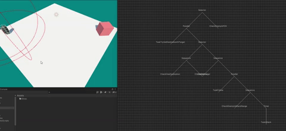
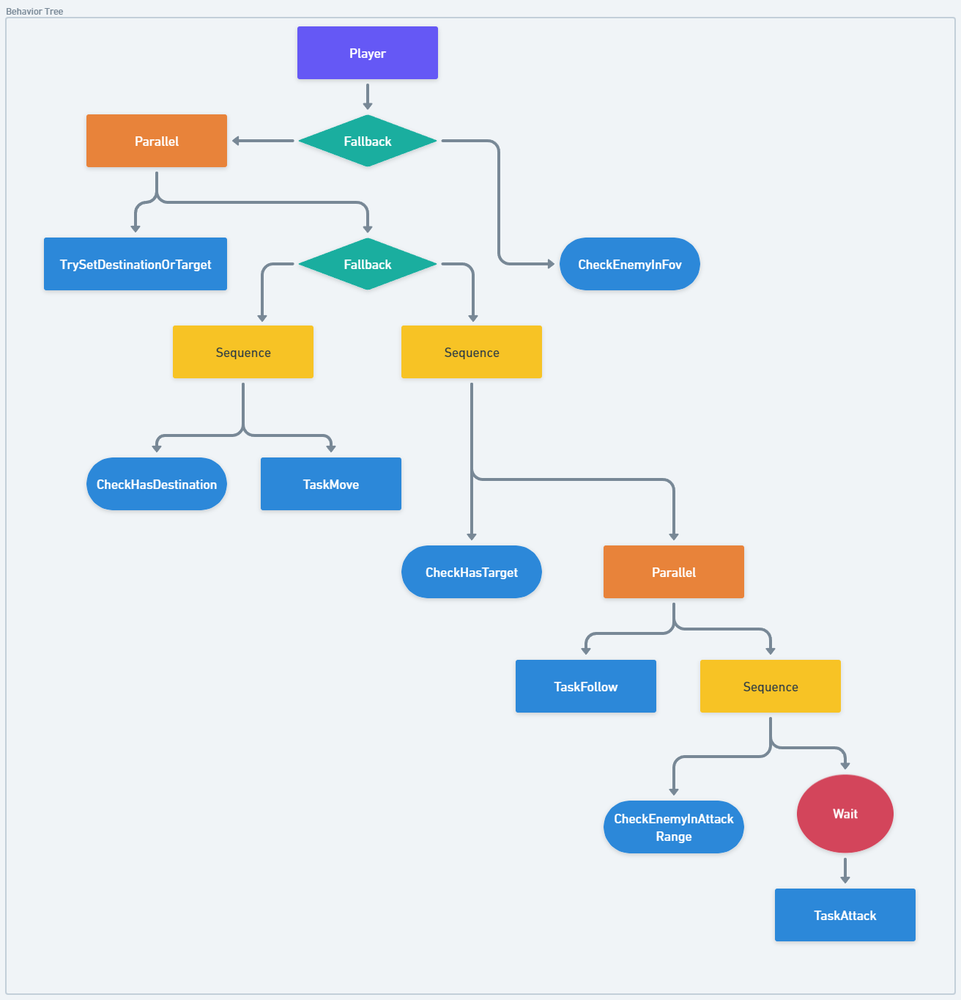

<!DOCTYPE html>
<html>
<head>
</head>
<body>
	<header>
		<h1>Unity Behavior Tree AI</h1>
  
   
	</header>
	<section>
		<h2>Features</h2>
		<ul>
			<li>Easy-to-use Behavior Tree AI system for Unity games</li>
			<li>Create complex AIs through code</li>
			<li>Extensible system - easily create new node types</li>
			<li>Visual debugger of the behavior tree</li>
			<li>View the behavior tree in the Unity editor window</li>
			<li>Debug the execution of the behavior tree</li>
		</ul>
	</section>
	<section>
		<h2>Getting Started</h2>
		<ol>
			<li>Clone the Git repository to your local machine.</li>
			<li>Import the <code>BTree</code> folder into your Unity project.</li>
			<li>Create a new C# script that inherits from <code>BehaviorTree</code>, and use it to define your AI's behavior tree.</li>
   <li>Create a new C# script that inherits from <code>Node</code>, and use it to define your own Node type.</li>
			<li>Use the provided node types to define the logic of your AI's behavior tree.</li>
			<li>Use the visual debugger to debug the execution of the behavior tree.</li>
		</ol>
	</section>
	<section>
		<h2>Usage</h2>
		
To use the Behavior Tree AI system, you will need to create a C# script that defines your AI's behavior tree. Here is an example of how to define a simple behavior tree:

		<pre>
// inherit from BehaviorTree class to setup a tree
public class MyAIBehaviorTree : BehaviorTree
{
// override Build function to setup root
    public override void Build()
    {
       Fallback root = new Fallback();
       Sequence sequence = new Sequence();
       sequence.AddChild(new MoveToNode());
       sequence.AddChild(new ShootNode());
       root.AddChild(sequence);
       root.AddChild(new PatrolNode());
     }
    
  }
</pre>

In this example, the behavior tree has a <code>Fallback</code> as its root node, which has two child nodes: a <code>Sequence</code> and a <code>PatrolNode</code>. The <code>Sequence</code> has two child nodes: a <code>MoveToNode</code> and a <code>ShootNode</code>.

Once you have defined your AI's behavior tree, you can use the visual debugger to debug the execution of the tree. To do this, select your AI game object in the Unity editor and open the Behavior Tree Debugger window(Windows/BehaviorTree). You can then step through the execution of the behavior tree and view the state of each node.

</section>
</body>
</html>
